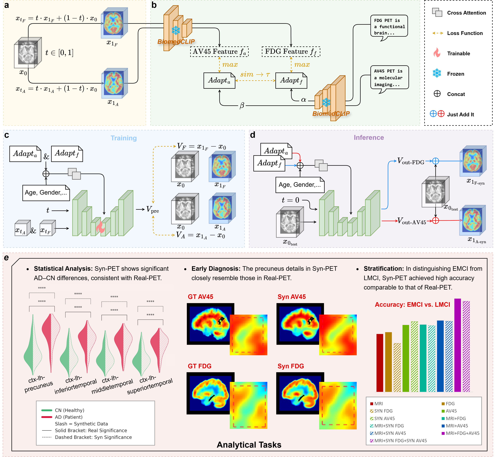

# DIReCT++: Precision Synthesis of Multi-Tracer PET from MRI via Vision-Language Model–Modulated Rectified Flow

## 🔍 Description

**DIReCT++** is a domain-informed generative framework designed to synthesize high-fidelity, patient-specific **18F-AV-45** and **18F-FDG** PET images from a single **T1-weighted MRI** and basic clinical text inputs (e.g., age, cognitive scores).

Built upon a **3D Rectified Flow model** and guided by a fine-tuned **BiomedCLIP** vision–language encoder, DIReCT++ captures complex cross-modal and cross-tracer biological relationships to generate accurate PET biomarkers **without requiring any actual PET scan**.

The model has been evaluated on **ADNI** and **OASIS-3** datasets, achieving:
- State-of-the-art PET synthesis quality  
- Strong generalizability  
- Faithful recapitulation of amyloid and metabolic patterns  

Synthetic PET combined with MRI enables precise stratification of MCI subtypes (e.g., EMCI vs. LMCI), supporting early diagnosis and prognosis of Alzheimer’s disease. The framework provides a **low-cost**, **radiation-free**, and **scalable AI tool** for multimodal biomarker profiling in clinical workflows.

---

## 🧭 Framework Overview

Overview of the DIReCT++ architecture for multimodal PET synthesis and downstream clinical analysis.

---

## 📦 Package Dependencies

Please ensure the following dependencies are installed:

| **Package**        | **Version**        | **Package**        | **Version**        |
|--------------------|--------------------|--------------------|--------------------|
| Python             | 3.10               | PyTorch            | 2.6.0+cu118        |
| torchvision        | 0.21.0+cu118       | torchaudio         | 2.6.0+cu118        |
| CUDA               | 11.8               | cuDNN              | 9.1.0              |
| einops             | 0.8.1              | transformers       | 4.40.2             |
| tokenizers         | 0.19.1             | safetensors        | 0.5.3              |
| xformers           | 0.0.29.post3       | faiss              | 1.9.0              |
| monai              | 1.5.1              | numpy              | 2.2.4              |
| scipy              | 1.15.2             | pandas             | 2.2.3              |
| scikit-learn       | 1.6.1              | matplotlib         | 3.10.1             |
| seaborn            | 0.13.2             | opencv-python      | 4.12.0.88          |
| nibabel            | 5.3.2              | tensorboard        | 2.19.0             |
| fsspec             | 2024.6.1           | huggingface-hub    | 0.30.1             |
| protobuf           | 6.30.2             | triton             | 3.2.0              |

---

## 🗂 Step 1. Data Preparation

### 🔹 ADNI
The ADNI dataset is publicly available upon registration at:

https://ida.loni.usc.edu

### 🔹 OASIS-3  
The OASIS-3 dataset (CC BY 4.0 license) is accessible at:

https://www.oasis-brains.org

Only **18F-AV-45 PET** scans processed by the **PUP pipeline (PET Unified Pipeline)** were used to ensure quantitative stability. **18F-FDG** PET scans from OASIS-3 were *not* used due to a lack of PUP processing.

### 🔹 MRI/PET Preprocessing Pipeline

To ensure precise anatomical alignment across modalities:

1. **MRI Preprocessing**
   - T1-weighted MRI skull-stripped using *FreeSurfer*  
   - Contrast normalized via histogram matching  

2. **PET–MRI Registration**
   - Each PET aligned to its paired MRI using rigid registration  
   - MRI and PET jointly affinely normalized to **MNI152** using *SPM*  
   - Shared affine matrix ensures cross-modality alignment  

3. **Voxel Standardization**
   - Cropped to **160 × 192 × 160** (1 mm³ isotropic)  
   - Intensities scaled to **[0, 1]** via min–max normalization  

4. **Regional Parcellation**
   - Brain parenchyma segmented into **98 anatomical regions** using **SynthSeg**  

---

## 🧠 Step 2. CLIP Pretraining

Please follow the instructions provided in:
[CLIP Pretrain](clip_pretrain/)

it includes notebook covers dataset preparation and BiomedCLIP fine-tuning procedures.

---

## 🚀 Step 3. Training DIReCT++

To train the dual-tracer rectified flow model, follow the notebook in:
[Training DIReCT++](train/)

